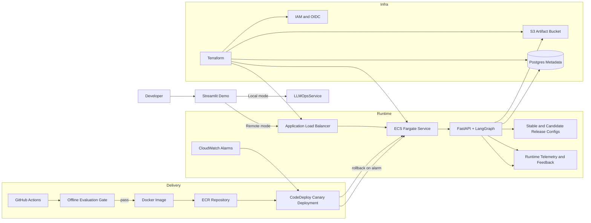

# Terraform-Based LLMOps Canary Platform

This project is a production-style **LLMOps platform** rather than just a single GenAI app. It deploys a sample `LangGraph` incident assistant behind an AWS ECS service and adds the controls that make GenAI systems production-ready:

- offline evaluation gates before release
- canary deployment for stable vs candidate versions
- release metadata and prompt versioning
- observability and feedback capture
- Terraform-managed infrastructure and CI/CD

## Why this project is valuable

It demonstrates the workflow companies actually need for GenAI in production:

1. ship a new prompt or model revision safely
2. evaluate it against a benchmark dataset
3. deploy it beside the stable version
4. shift a small percentage of live traffic with a canary rollout
5. monitor quality, latency, and cost
6. rollback automatically if alarms fire

The sample workload is an **incident response copilot**, but the main asset is the **platform** that governs release quality and deployment safety.

## Architecture



## Repository Layout

```text

|-- configs/
|   -- releases/
|-- data/
|   -- evals/
|-- deploy/
|-- infra/
|   |-- environments/dev/
|   -- modules/
|-- scripts/
|-- src/llmops_platform/
|-- tests/
```

## Local Workflow

1. Install dependencies:

   ```bash
   python -m pip install -e .[dev,demo]
   ```

2. Run the API locally:

   ```bash
   python -m llmops_platform.main
   ```

3. Launch the Streamlit demo UI:

   ```bash
   streamlit run streamlit_app.py
   ```

   The demo supports two modes:

   - `Local service`: runs the same `LLMOpsService` in-process
   - `Remote API`: points Streamlit at a deployed ALB endpoint such as `http://<alb-dns-name>`

4. Run the offline evaluation gate:

   ```bash
   python -m scripts.run_evaluation \
     --stable configs/releases/stable.yaml \
     --candidate configs/releases/candidate.yaml \
     --dataset data/evals/incidents.jsonl \
     --output artifacts/evaluations/latest.json
   ```

5. Example request:

   ```bash
   curl -X POST http://localhost:8080/v1/respond \
     -H "Content-Type: application/json" \
     -d '{
       "question": "What is the likely root cause and next action?",
       "context": {
         "service": "payments-api",
         "severity": "high",
         "summary": "Latency spiked after a deployment.",
         "recent_changes": ["Deployed release 2026.03.08-1"],
         "logs": ["timeout while calling inventory-service"],
         "metrics": {"cpu_utilization": 94, "p95_latency_ms": 2200},
         "runbook_excerpt": "If latency spikes after a deploy, rollback first and validate downstream saturation."
       }
     }'
   ```

6. Optional: point the Streamlit UI at your deployed service:

   ```bash
   export STREAMLIT_API_BASE_URL=http://your-alb-dns-name
   streamlit run streamlit_app.py
   ```

   On Windows `cmd`, use:

   ```bat
   set STREAMLIT_API_BASE_URL=http://your-alb-dns-name
   streamlit run streamlit_app.py
   ```

## Release Model

Each release is defined in YAML and bundles:

- provider and model name
- system prompt
- tool policy
- evaluation thresholds
- canary traffic weight

`stable.yaml` and `candidate.yaml` let you test a release promotion path without changing the app code.

## Terraform Scope

Terraform provisions:

- VPC, subnets, routes, NAT
- S3 bucket for evaluation artifacts
- RDS PostgreSQL for release metadata
- ECR repository
- ECS Fargate cluster and service
- ALB and target groups
- CodeDeploy ECS canary deployment group
- CloudWatch log groups and alarms
- GitHub Actions OIDC role for CI/CD

The ECS service uses **CodeDeploy** with `CodeDeployDefault.ECSCanary10Percent5Minutes`, so a candidate revision receives 10% of production traffic before full promotion.

## CI/CD Flow

1. `app-ci.yml` runs tests and the evaluation gate.
2. `terraform.yml` validates Terraform.
3. `deploy.yml`:
   - builds the candidate image
   - pushes to ECR
   - registers a new ECS task definition
   - renders a CodeDeploy AppSpec
   - creates a CodeDeploy deployment

## Demo Flow

Use the Streamlit app for fast walkthroughs:

1. start the FastAPI service locally or keep the app in `Local service` mode
2. open `streamlit_app.py`
3. load a sample incident or enter your own context
4. compare `stable` vs `candidate` behavior
5. capture operator feedback from the same UI

## Environment Variables

| Variable | Purpose |
| --- | --- |
| `APP_PORT` | API port, default `8080` |
| `ENVIRONMENT` | runtime environment |
| `STABLE_RELEASE_PATH` | path to stable YAML |
| `CANDIDATE_RELEASE_PATH` | path to candidate YAML |
| `CANDIDATE_WEIGHT` | local canary routing weight |
| `OPENAI_API_KEY` | optional, enables OpenAI-backed responder |
| `LANGSMITH_API_KEY` | optional tracing integration |
| `METRICS_OUTPUT_PATH` | local JSONL event log |
| `STREAMLIT_API_BASE_URL` | optional default remote endpoint for the Streamlit demo |

## Notes

- The app defaults to a deterministic mock responder so the platform can be tested without external model calls.
- Swap to `provider: openai` in the release config to use a real LLM.
- `terraform.tfvars` is intentionally ignored so local AWS account details and secret ARNs are not committed.
- The `dev` environment can be applied and destroyed from `infra/environments/dev` when you want a short-lived AWS demo.
